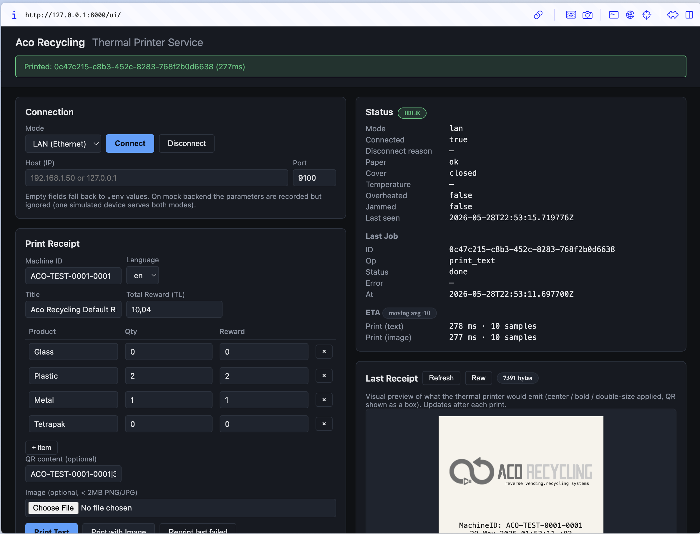
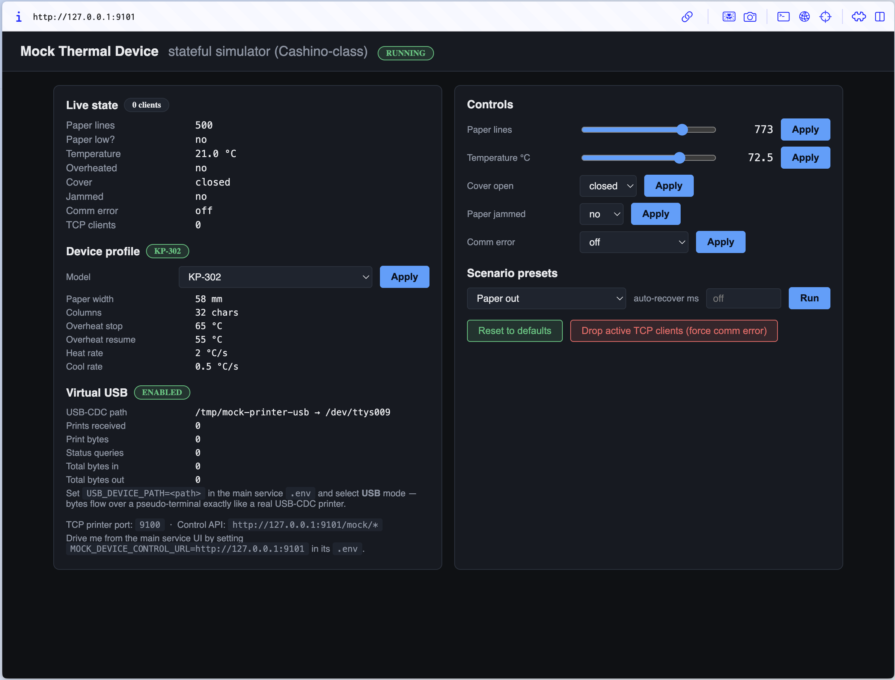

# Thermal Printer Service

A local FastAPI microservice driving Cashino KP-300 / KP-301H / KP-302
ESC/POS thermal printers over USB or LAN. Exposes a small REST API,
persists every job in SQLite, ships with a vanilla-JS web UI, and
includes a fully simulated mock device so the whole flow can be
demonstrated and tested without hardware.

**Stack:** Python 3.13 · FastAPI · SQLite (WAL) · vanilla JS ·
python-escpos · pyserial · pyusb · Pillow · psutil.

**Tested with:** 202 automated tests · in-process mock · standalone
mock over TCP 9100 · standalone mock over a PTY USB-CDC bridge.
Verification against a physical Cashino device is an on-site step (no
hardware was available during development).

**Recent features at a glance:**

* **One-tap direct-cable connect** — `POST /connect {"mode":"lan_direct"}`
  scans every active wired interface and attaches automatically when it
  finds the printer. No IP entry needed. Dress-rehearsable against the
  mock in `DEV_MODE`.
* **Auto-discovery pickers in the UI** — USB-style dropdowns for both
  cable Ethernet (`lan_direct`) and routed LAN (`/discover/lan`),
  plus the existing USB-CDC + libusb pickers. Pick, then Connect.
* **Three Reprint paths** — paste a UUID, pick from a "recent failures"
  dropdown, or fire `/reprint/last-failed` with an empty body. Same
  byte-for-byte replay backed by the SQLite BLOB.
* **Full TR / EN UI localization** with a top-right language picker on
  both the service UI and the standalone mock dashboard. Choice
  persists across reloads. Server-side error messages (`message_tr`,
  `message_en`) are routed to whichever language the operator picked.

---

## 1. Install & run

Requires Python ≥ 3.11.

### Recommended — host install (Linux / macOS / Windows)

```bash
git clone https://github.com/OgunSerifOnargan/thermalPrinterManager.git
cd thermalPrinterManager

# macOS / Linux
./setup.sh

# Windows (PowerShell)
.\setup.ps1
```

The bootstrap script creates `.venv/`, installs `requirements.txt`,
and copies `.env.example` → `.env` (your runtime config). Idempotent —
safe to re-run.

Then in **two terminals**:

```bash
# Terminal 1 — mock device (TCP 9100 + dashboard 9101)
.venv/bin/python scripts/mock_device_server.py

# Terminal 2 — service
.venv/bin/uvicorn app.main:app --host 127.0.0.1 --port 8000
```

Open:

* **Service UI** — <http://127.0.0.1:8000/ui/>
* **Mock device dashboard** — <http://127.0.0.1:9101/>

Click **Connect** (LAN mode) in the UI, then **Print Text**. You should
see a green "done" banner and the mock dashboard's paper counter tick
down.

Windows users substitute `.\.venv\Scripts\python.exe` and
`.\.venv\Scripts\uvicorn.exe`.

#### What you'll see

**Service UI** (<http://127.0.0.1:8000/ui/>) — connection panel + print
form on the left, live status / last job / ETA / receipt preview on the
right:



**Mock device dashboard** (<http://127.0.0.1:9101/>) — live counters,
device profile (KP-300/301H/302), virtual-USB info, scenario presets,
and sliders to inject paper / temperature / cover / jam / comm-error
faults:



### Driving a real Cashino

Once the mock loop above works, the steps for a physical Cashino are
the same — just flip the backend and point it at the device.

#### Step 1 — Switch to the real transport backend

One line in `.env`:

```ini
TRANSPORT_BACKEND=real
```

That swaps the in-process mock for the real `LanTransport` /
`SerialTransport` / `UsbTransport`. Restart the service. Nothing else
in `.env` is required — the device address can travel in the
`/connect` request body.

#### Step 2a — Connect over Ethernet (LAN)

**One-tap, direct cable** (printer plugged straight into the PC, no
router in between — the default for a kiosk demo):

```bash
curl -X POST http://127.0.0.1:8000/connect \
  -H 'Content-Type: application/json' \
  -d '{"mode":"lan_direct"}'
# 200 → service discovered exactly one Cashino-shaped printer on a
#       wired interface and connected automatically; body carries the
#       resolved {host, port, via_interface, rtt_ms}.
# 503 NO_DIRECT_DEVICE     → no Cashino reply on any wired interface.
# 409 MULTIPLE_CANDIDATES  → more than one match; pick one from the
#                            candidates list and call /connect again
#                            with mode=lan + the picked host.
```

The UI's Connection panel ships with this as the default mode — plug
the cable and press **Connect**, no IP entry needed. When you select
that mode, the UI populates a dropdown of detected Cashinos via
`GET /discover/cable` (USB-style picker); pick one, press Connect.

**Dress-rehearsal against the mock.** When the service runs with
`DEV_MODE=true` (the dev default), the discovery includes a synthetic
loopback interface so the local mock device shows up in the dropdown
too. You can practice the full plug-and-Connect flow before walking
into the demo room without a physical cable in the loop.

**On a normal LAN behind a router**, you can either type the IP
manually (`mode=lan` with `lan_host`/`lan_port`) or ask the service
to sweep your local /24 first:

```bash
curl http://127.0.0.1:8000/discover/lan
# → {"local_ip":"192.168.1.20","subnet":"192.168.1.0/24",
#    "port":9100,"scanned":253,"tcp_open":2,
#    "candidates":[
#      {"host":"192.168.1.50","port":9100,"rtt_ms":12,
#       "looks_like_cashino":true,"status_byte":"0x12"}]}
```

This sweep relies on a default route, so it won't work for the
direct-cable case — use `lan_direct` there instead.

Then connect to the host you picked:

```bash
curl -X POST http://127.0.0.1:8000/connect \
  -H 'Content-Type: application/json' \
  -d '{"mode":"lan","lan_host":"192.168.1.50","lan_port":9100}'
```

Verify the link is up:

```bash
curl http://127.0.0.1:8000/status
# → connection.connected: true,  connection.mode: "lan",  device.paper: "ok"
```

Or do the same thing from the UI: pick **LAN (Ethernet)** in the
Connection panel, type the IP, click **Connect**.

#### Step 2b — Connect over USB-CDC

Cashino enumerates as a USB-CDC serial device. Find its path first
(the service includes a helper that scans `/dev/cu.*`, `/dev/ttyACM*`,
and Windows `COM*`):

```bash
curl http://127.0.0.1:8000/usb/devices
# → { "cdc": ["/dev/cu.usbserial-A1B2C3", ...], "libusb": [...] }
```

Then connect:

```bash
curl -X POST http://127.0.0.1:8000/connect \
  -H 'Content-Type: application/json' \
  -d '{"mode":"usb","usb_device_path":"/dev/cu.usbserial-A1B2C3"}'
#   macOS:   /dev/cu.usbserial-*  or  /dev/cu.usbmodem*
#   Linux:   /dev/ttyACM*         or  /dev/ttyUSB*
#   Windows: COM3 (check Device Manager → Ports)
```

The UI alternative is the **USB** mode dropdown in the Connection
panel; the device-picker reads from the same `/usb/devices` helper.

Windows additionally needs **Zadig** + `libusb-win32` (manual driver
bind, one-time) before the device shows up. macOS needs `brew install
libusb` for the `libusb` path; CDC mode works without it. Linux needs
udev permissions — `setup.sh` offers to install the rule for you.

#### Step 3 — Send a test print

Once `/status` reports `connected: true`, the same `/print/text`
endpoint that drove the mock now drives the real printer:

```bash
curl -X POST http://127.0.0.1:8000/print/text \
  -H 'Content-Type: application/json' \
  -d '{
    "machine_id":"KIOSK-01",
    "items":[
      {"product":"Plastic","quantity":2,"reward":2.0},
      {"product":"Metal","quantity":1,"reward":1.0}
    ],
    "total_reward":3.0,
    "qr_content":"KIOSK-01|TX-9876|3.00|TL",
    "lang":"tr"
  }'
# → { "ok": true, "job_id": "...", "status": "done", "duration_ms": ... }
```

A physical receipt comes out. If it doesn't, `/status` will already be
reporting the fault (`device.paper`, `device.cover`, `device.jammed`)
and the response body will carry the `error_code` and a localized
message.

#### Optional — auto-connect on startup

If you'd rather not call `/connect` after every restart, bake the
defaults into `.env`:

```ini
DEFAULT_MODE=lan                       # or usb
LAN_HOST=192.168.1.50                  # used when DEFAULT_MODE=lan
USB_DEVICE_PATH=/dev/cu.usbserial-A1B2C3   # used when DEFAULT_MODE=usb
```

The service will open the link in lifespan startup before it accepts
its first HTTP request.

### Docker (alternative — full stack one-command)

```bash
docker compose up -d
```

Brings up the service (8000) and the mock device (9100 / 9101) in
linked containers. Docker on macOS/Windows cannot pass host USB ports
through to a container — for real USB, use the host install above. See
[`docs/operations.md`](docs/operations.md) for the Linux
device-passthrough snippet.

---

## 2. Architecture

```
   ┌──────────────────────────────────────────────────────────────────┐
   │                       Web UI (vanilla JS)                        │
   └──────────────────────────────┬───────────────────────────────────┘
                                  │  HTTP / JSON
   ┌──────────────────────────────▼───────────────────────────────────┐
   │   FastAPI Routes  — thin: validate, delegate                     │
   │   + error_handlers   + dependencies   + (DEV) /mock/* routes     │
   ├──────────────────────────────────────────────────────────────────┤
   │   PrinterService — orchestrator                                  │
   │   pre-check ─► render ─► send ─► GS r 1 fence ─► post-check      │
   └──┬───────────────┬─────────────────┬─────────────────┬───────────┘
      │               │                 │                 │
  ┌───▼──────────┐ ┌──▼──────────┐ ┌────▼──────────┐ ┌────▼─────────┐
  │ ReceiptRender│ │ JobRepository│ │ PaperPredictor│ │ EtaService   │
  │ ┌──────────┐ │ │ SQLite (WAL) │ │ mm-based      │ │ moving avg   │
  │ │ Encoding │ │ │ idempotency  │ │ remaining mm  │ │ ms / print   │
  │ │ cp857+TR │ │ │ payload BLOB │ │ + LF + image  │ │ text vs image│
  │ ├──────────┤ │ │ retention    │ │   height      │ │              │
  │ │ ImageProc│ │ └──────────────┘ └───────────────┘ └──────────────┘
  │ │ raster+QR│ │
  │ ├──────────┤ │
  │ │ escpos_  │ │
  │ │  cmds    │ │
  │ └──────────┘ │
  └───────┬──────┘
          │  ESC/POS bytes (stored as BLOB, sent over the wire)
          ▼
   ┌──────────────────────────────────────────────────────────────────┐
   │ ConnectionManager — state machine, target_mode, device lock,     │
   │                      cached status                               │
   │   ◄── StatusDecoder  (DLE EOT n=2,3,4 → DeviceStatus)            │
   │   ◄── ReconcileLoop  (asyncio task: backoff + breaker)           │
   └──────────────────────────────┬───────────────────────────────────┘
                                  │
   ┌──────────────────────────────▼───────────────────────────────────┐
   │   DeviceTransport (abstract)                                     │
   │   ├─ MockTransport ──► MockPrinter brain                         │
   │   ├─ LanTransport     (raw TCP 9100, stdlib socket)              │
   │   ├─ SerialTransport  (USB-CDC via pyserial)                     │
   │   └─ UsbTransport     (python-escpos + libusb)                   │
   └──────────────────────────────────────────────────────────────────┘
```

Design rationale (why declarative connection, why `GS r 1` fence, why
an ESC/POS-aware mock parser, why a payload-bytes BLOB), mermaid
sequence diagrams, and the disconnect-reason taxonomy:
[`docs/architecture.md`](docs/architecture.md).

---

## 3. API

Core endpoints:

| Method | Path | Purpose |
|---|---|---|
| POST | `/connect` | Set target mode (`usb`/`lan`) and open the link |
| POST | `/print/text` | Render and print a receipt from JSON |
| POST | `/print/image` | Same but embeds a base64 image |
| POST | `/reprint` | Replay a stored job by `job_id` |
| POST | `/reprint/last-failed` | Replay the most recently failed job — no UUID needed (server-side lookup) |
| GET  | `/jobs/failed?limit=N` | List recent ERROR-status jobs within TTL — powers the UI's failure picker |
| GET  | `/status` | Connection + device + last-job snapshot |
| GET  | `/logs` | Recent JSONL events |

Operational endpoints: `/healthz`, `/disconnect`, `/logs/export`,
`/config` (token-guarded PATCH), `/assets/logo`, `/preview/qr`,
`/discover/lan` (subnet scan via default-route interface),
`/discover/cable` (wired-interfaces scan, no auto-connect — feeds the
UI's lan_direct picker), `/discover/usb` (alias of `/usb/devices`),
and dev-only `/mock/*` for fault injection.

Full reference (schemas, error codes, per-endpoint curl):
[`docs/api.md`](docs/api.md). Error-code semantics and recovery paths:
[`docs/errors.md`](docs/errors.md).

### Quick curl examples

```bash
# Connect via LAN
curl -X POST http://127.0.0.1:8000/connect \
  -H 'Content-Type: application/json' -d '{"mode":"lan"}'

# Print a Turkish receipt with QR
curl -X POST http://127.0.0.1:8000/print/text \
  -H 'Content-Type: application/json' \
  -d '{
    "machine_id":"KIOSK-01",
    "items":[
      {"product":"Plastic","quantity":2,"reward":2.0},
      {"product":"Metal","quantity":1,"reward":1.0}
    ],
    "total_reward":3.0,
    "qr_content":"KIOSK-01|TX-9876|3.00|TL",
    "lang":"tr"
  }'

# Direct-cable one-tap: printer plugged straight into the PC, no router
curl -X POST http://127.0.0.1:8000/connect \
  -H 'Content-Type: application/json' -d '{"mode":"lan_direct"}'
# 200 + resolved { host, port, via_interface, rtt_ms } when exactly one
# Cashino-shaped reply was found on a wired interface. Otherwise 503
# NO_DIRECT_DEVICE (no reply on any wired iface) or 409 MULTIPLE_CANDIDATES.

# Trigger PAPER_OUT in the mock, recover, then reprint the failed job
curl -X POST http://127.0.0.1:8000/mock/run_scenario \
  -H 'Content-Type: application/json' -d '{"scenario":"paper_out"}'
# ... print returns 503 PAPER_OUT; load paper / recover:
curl -X POST http://127.0.0.1:8000/mock/run_scenario \
  -H 'Content-Type: application/json' -d '{"scenario":"recover_all"}'

# Three reprint paths — pick whichever fits your client:
#  (a) Specific UUID (paste from logs or your own bookkeeping):
curl -X POST http://127.0.0.1:8000/reprint \
  -H 'Content-Type: application/json' -d '{"job_id":"<failed-id>"}'
#  (b) Server picks the most recent failure for you — no body needed:
curl -X POST http://127.0.0.1:8000/reprint/last-failed
#  (c) List the last 5 failures (UI dropdown feeder, also scriptable):
curl http://127.0.0.1:8000/jobs/failed?limit=5

# CSV log export
curl -OJ "http://127.0.0.1:8000/logs/export?format=csv"
```

---

## 4. Configuration

Runtime settings live in `.env`, loaded once at startup with Pydantic
fail-fast validation (the service exits on bad values rather than
silently misbehaving). See [`.env.example`](.env.example) for the
full annotated list and [`docs/operations.md`](docs/operations.md) for
ops-level reference (logging, retention, healthcheck, auth, rate
limit, backup).

---

## 5. Testing

```bash
.venv/bin/pytest              # all 202
.venv/bin/pytest tests/unit/  # 107 unit
.venv/bin/pytest -k fence     # one topic — GS r 1 print-done fence
.venv/bin/pytest -k lan_direct # one topic — direct-cable discovery + connect
```

Test inventory by category and the capability-to-test mapping:
[`docs/test-summary.md`](docs/test-summary.md).

---

## 6. Project layout

```
app/
  api/          routes, error handlers, dependencies, mock endpoints
  core/         config, logging, states, errors, clock, auth, rate-limit
  devices/      transport ABC, mock printer brain, mock + LAN + serial + USB
  models/       Pydantic schemas (request / response DTOs)
  services/     connection_manager, reconcile_loop, printer_service,
                 job_repository, receipt_renderer, encoding, image_processor,
                 prediction, eta, log_reader, factory
  ui/           index.html + app.js + style.css (vanilla JS)
  assets/       static assets (logo)
  main.py       FastAPI app + lifespan
docs/           full documentation (see §7)
scripts/        mock_device_server.py (standalone mock), lan_listener.py, udev/
tests/          unit (107) + integration (96) — 203 total
Dockerfile         service image
Dockerfile.mock    standalone mock image (TCP 9100 + HTTP 9101)
docker-compose.yml linked stack
setup.sh / setup.ps1  bootstrap (venv + requirements + .env)
.env / .env.example   runtime config
```

---

## 7. Documentation

| File | What's in it |
|---|---|
| [`docs/api.md`](docs/api.md) | Full API reference — schemas, examples, error codes |
| [`docs/architecture.md`](docs/architecture.md) | Diagrams, sequence flows, design rationale, disconnect taxonomy |
| [`docs/escpos.md`](docs/escpos.md) | ESC/POS protocol primer + mock parser case study |
| [`docs/errors.md`](docs/errors.md) | Error catalog — triggers, recovery, UI behavior, mock simulation |
| [`docs/operations.md`](docs/operations.md) | Deployment, env vars, healthcheck, auth, troubleshooting |
| [`docs/test-summary.md`](docs/test-summary.md) | Test inventory + capability coverage matrix |
| [`docs/demo_checklist.md`](docs/demo_checklist.md) | Pre-demo run-book (mock-only and real device) |
| [`docs/limitations.md`](docs/limitations.md) | Deliberate exclusions with rationale |
