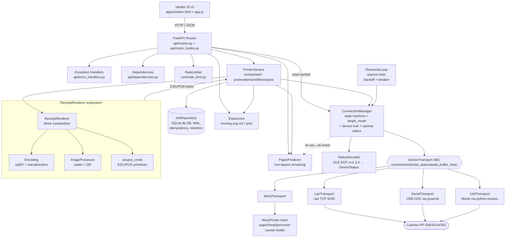
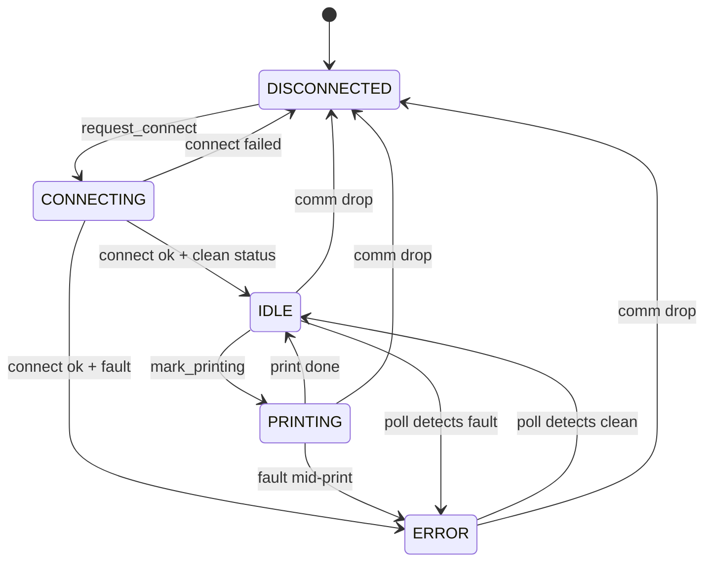

# Architecture

## Component overview



Notes on the layering:

* **PrinterService** is the *only* component that orchestrates a full
  print — it composes the renderer's output, persists the job, acquires
  the device lock, runs pre-check / send / GS r 1 fence / post-check,
  and updates predictor + ETA.
* **ReceiptRenderer** is a composition: `Encoding` (own cp857 +
  transliteration since python-escpos has no Cashino profile),
  `ImageProcessor` (PIL dither + raster encoding + QR command emission),
  `escpos_cmds` (raw ESC/POS primitive byte sequences). The renderer
  itself just composes blocks in the right order.
* **ConnectionManager** is the *only writer* to the device. It owns the
  `asyncio.Lock` that `PrinterService` acquires for the full print
  sequence; it owns the `StatusDecoder` that turns DLE-EOT bytes into a
  structured `DeviceStatus`; and it owns the cached snapshot that
  `GET /status` reads instantly without touching the device.
* **ReconcileLoop** is a separate asyncio task that watches the
  manager's `target_mode` and brings the link back up on drops
  (exponential backoff + breaker). It never writes to the device
  directly — only via the manager's API.
* **SerialTransport** is the USB-CDC code path — Cashino printers
  enumerating as `/dev/cu.usbserial-*` (macOS), `/dev/ttyACM*` (Linux),
  or `COM*` (Windows). It also drives the mock device's PTY bridge
  (`/tmp/mock-printer-usb`) for hands-off USB-CDC testing.

## Print sequence


## State machines

### Printer state (`PrinterState`)



### Job state (`JobStatus`)

```
received  →  printing  →  done
                       ↘  error
```

## Disconnect reason taxonomy

| Reason | Reconcile retries? | Source |
|---|---|---|
| `startup` | yes | service boot with `DEFAULT_MODE` set |
| `comm_error` | yes | link dropped while connected |
| `connect_failed` | yes | a connect attempt failed |
| `user_requested` | **no** | `POST /disconnect` |
| `mode_change` | no (next connect will follow) | `POST /connect` with new mode |
| `breaker_open` | **no** | retries exceeded `BREAKER_THRESHOLD` |

---

## Design rationale

The service makes a thermal printer behave like any other HTTP-driven
dependency — even though printers in the wild are flaky (paper, head
heat, jams, cables, network) and ESC/POS is a 30-year-old binary
protocol with no native error model. Three problem areas drove the
non-obvious choices below; a fourth keeps everything substitutable for
tests and demos.

### 1. The physical link is unreliable, so the connection is *declarative*

A connection isn't a one-shot setup; it's a **state to maintain**.
Cables get unplugged, network routes flap, USB devices re-enumerate,
printers reboot. The naïve approach — sprinkling `connect()` /
`reconnect()` calls through the code paths that need a working device —
becomes a tangle of `if connected:` checks and duplicated retry logic.

So the service holds a single declarative variable: **`target_mode`**.
The caller says "be connected via LAN" once. A separate `ReconcileLoop`
asyncio task watches `target_mode` and the actual link state and brings
them into agreement: first connect, reconnect after a drop, exponential
backoff, breaker after `BREAKER_THRESHOLD` consecutive failures.
There's no separate "connect path" and "reconnect path" — both are just
the loop noticing that *current state ≠ target state*.

To make recovery deterministic, every disconnect carries a
**`disconnect_reason`** (see the taxonomy above). The reason tells the
loop whether to retry — `comm_error` yes, `user_requested` no,
`breaker_open` only after manual rearm — so we keep exactly one
`DISCONNECTED` state plus metadata instead of inventing a new state per
scenario.

Wake-ups are event-driven, not polled. A finished print, a user
disconnect, a mode change all fire **`state_change_event`**. The loop
sleeps on it; reconnect happens within milliseconds of becoming
possible rather than waiting for the next 1-second poll tick.

### 2. A receipt is financial proof, so the print path is conservative and the job store is the source of truth

Once an upstream transaction is recorded, the receipt is the only
artifact the customer holds. The print path is built so that "success"
is hard-won and replay is trivial.

Each print goes through four checkpoints under the device lock:
**pre-check** (read `DLE EOT n=2,3,4` for cover / jam / paper / heat;
any fault → fail fast before sending bytes), **send** (write the
rendered ESC/POS payload), **`GS r 1` fence** (a *buffered* status
command — the printer only answers after it has fed every byte before
it onto paper, per Cashino KP-300 manual p.63), and **post-check**
(re-read status to catch mid-print degradation). Only after all four
pass does the job get marked `DONE`. If any fails, the job is `ERROR`
with a specific `error_code` and the **bytes stay reprintable**.

The rendered payload is persisted to SQLite as a **BLOB** — not the
JSON it was rendered from. That means a reprint produces a
byte-for-byte identical receipt months later even if the renderer code
changes; the historical artifact is durable, the renderer is allowed
to evolve. Duplicate-submission safety is handled by a `UNIQUE`
constraint on `idempotency_key` plus `INSERT OR IGNORE`, so a retried
HTTP request with the same key races cleanly and only one job runs.

`GET /status` **never touches the device**. The `ConnectionManager`
keeps a cached snapshot updated by the background poll; clients read it
in microseconds without contending with the print path's lock. UIs can
poll at 1 Hz with no overhead.

### 3. ESC/POS is finicky, so the renderer, the decoder, and the mock are all written to absorb that

The protocol has three gaps that bite if you ignore them.

**Encoding.** Cashino has no profile in `python-escpos`'s `magicencode`
registry, so unknown characters raise from the print path — fatal in a
financial flow. We emit cp857 (Turkish DOS) ourselves with a
transliteration fallback (`ş→s` when needed, `₺→TL`, smart quotes →
ASCII). The print path **never raises** from encoding; the worst case
is a substituted glyph that's logged and visible.

**Status reads are byte-aligned and can be polluted.** The host sends
`DLE EOT n` (3 bytes) and reads exactly 1 byte back. If a stray byte
sits in the input buffer — left over from a previous command, or worse,
from a *mid-payload byte that looked like a command* — the host reads
it instead of the actual answer and the decoder produces a phantom
fault. Real example: a typical receipt is ~7 KB of ESC/POS; QR data
and image raster sections contain arbitrary bytes, including occasional
`10 04` pairs (which look like `DLE EOT`) and `1D 72` pairs (which look
like `GS r`). A naïve mock parser fires spurious replies on those, and
those replies pollute later legitimate reads — we hit this as a
deterministic false `PAPER_JAM` at paper-low. The fix is twofold: the
mock now **mirrors real firmware** with a state machine that tracks
when it's inside a `GS v 0 / GS ( k / ESC * / GS *` data section and
skips command matching there, and the transports **drain the input
buffer** before each status read as defense in depth. Full case study:
[`escpos.md §5`](escpos.md#5-the-paper_jam-case-study).

**Error codes are scattered status bits, not a stable set.** Instead
of an `if / elif` chain scattered across the print path, every error
type is one row in an **`ERROR_POLICY` dict**: code, category (hardware
/ comm / command), HTTP status, auto-recoverable flag, recovery owner
(polling loop vs reconcile loop), Turkish + English user messages.
Adding a new error code is a one-line change; the request handlers,
the UI banner logic, the state machine, and the localisation layer all
read from the same table.

### 4. The whole stack should swap to mock or real without touching higher layers

Everything above is wired through a `DeviceTransport` abstract
interface that all four implementations (in-process `MockTransport`,
`LanTransport` TCP, `SerialTransport` USB-CDC, `UsbTransport` libusb)
satisfy. Service code doesn't import any concrete transport; the
wiring happens once in lifespan startup based on `.env`. That's what
makes the docker compose demo work without hardware, the test suite
deterministic and fast, and the on-site smoke test a configuration
change rather than a code change. The same seam is why the bug story
in §3 above was reproducible and fixable in software — the mock and
the real device exchange the same bytes through the same code path.
